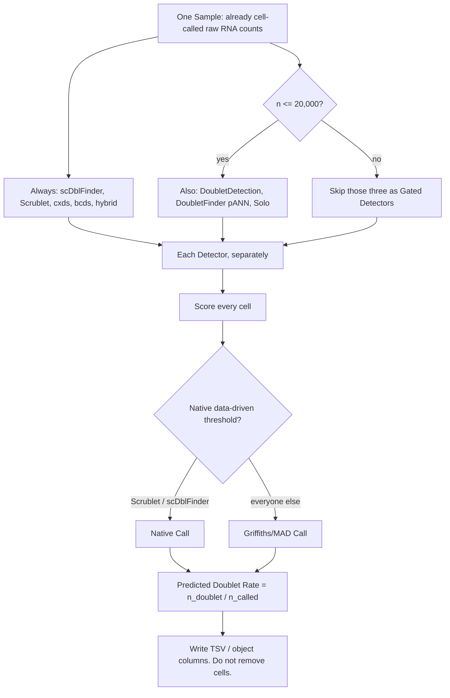

# RNA-only doublet rate

Score every cell in **one [Sample](CONTEXT.md#sample)**, make a data-driven [Call](CONTEXT.md#doublet-call), and report a [Predicted Doublet Rate](CONTEXT.md#predicted-doublet-rate) (`n_doublet / n_called`). This repository **does not [remove](CONTEXT.md#removal) cells** and does not fuse [Detectors](CONTEXT.md#detector).

Installable as R **doubletRate** (Seurat first) and Python **rna-doublet-rate** (import `doublet_rate`). CLI flags, output tables, and the Detector roster live in the run contract: **[SKILL.md](SKILL.md)**.

## Method



## Quick Start

```bash
git clone https://github.com/bio-apple/doublet.git
cd doublet
python3 -m pip install -e ".[full]"
Rscript scripts/install_r_packages.R
R CMD INSTALL .
python3 -m doublet_rate --list-detectors
python3 -m doublet_rate test --output-dir test_out --write-h5ad
```

[`test/`](test/) is 10x pbmc3k filtered MTX (2,700 cells). It writes `test_out/test.doublet_sample.tsv`. That command runs the **full roster**, including Solo (slow). `--list-detectors` only prints `always` / `gated`.

Seurat:

```r
library(doubletRate)
seu <- annotate_doublets(seu)
```

Scanpy:

```python
from doublet_rate import detect_doublets

adata = detect_doublets(adata)
```

Flags, output files, object columns, and the [Detector](CONTEXT.md#detector) table: [SKILL.md](SKILL.md). `doublet_score` / `predicted_doublet` copy one [Primary Detector](CONTEXT.md#primary-detector) (default scDblFinder), not a consensus. [Gated Detectors](CONTEXT.md#gated-detector) skip above 20,000 cells or, for Solo, when there is no GPU.

## Documentation

This README is the five-minute start. Do not copy CLI or Detector details here; change them in [SKILL.md](SKILL.md).

| File | What it is | When to open it |
|---|---|---|
| [SKILL.md](SKILL.md) | **Run contract**. CLI, legal input, output tables, Detector roster, object APIs, do-not list. | You are running the tool, wrapping it, or telling an agent what to run. |
| [CONTEXT.md](CONTEXT.md) | Domain **glossary**. | You need the words this repo uses, and the words it refuses. |
| [reference.md](reference.md) | **Parameter and source notebook**. Forbidden cutoffs, Call rules, skip reasons, citations. | You need an exact threshold, a skip reason, or a citation. |
| [docs/adr/](docs/adr/) | **Architecture Decision Records**. | The code looks oddly strict and you want *why*. |

Typical ADR questions:

- Why report a rate and **not delete** called doublets? → [0001](docs/adr/0001-score-call-rate-not-removal.md)
- Why refuse `nExp` / `dbr` / 10x 0.8% per 1000 cells as a threshold? → [0002](docs/adr/0002-no-expected-rate-for-calls.md)
- Why eight methods side by side, with no consensus column? → [0004](docs/adr/0004-parallel-methods-no-fusion.md)
- Why Predicted Doublet Rate uses `n_called`, not `n_input`? → [0011](docs/adr/0011-rate-denominator-is-n-called.md)
- Why DoubletDetection / DoubletFinder / Solo skip above 20,000 cells? → [0005](docs/adr/0005-detector-roster-and-size-gate.md)
- Why there are both `doubletRate` and `doublet_rate`? → [0013](docs/adr/0013-dual-r-python-packages.md)

Full index: [docs/adr/README.md](docs/adr/README.md).
