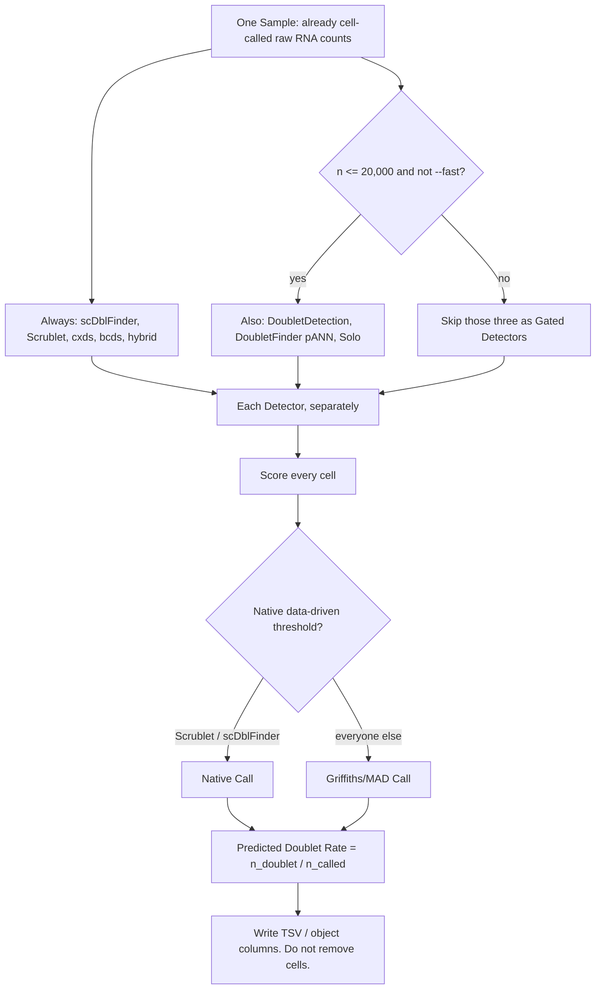

# RNA-only doublet rate

Score every cell in **one Sample**, make a data-driven Call, and report a Predicted Doublet Rate (`n_doublet / n_called`). This repository **does not remove cells**.

Installable as R package **doubletRate** and Python package **rna-doublet-rate** (import `doublet_rate`). Words: [CONTEXT.md](CONTEXT.md). How to run (full contract): [SKILL.md](SKILL.md). Parameters and citations: [reference.md](reference.md). Why the rules exist: [docs/adr/](docs/adr/).

## Method



Detectors are not fused. Expected loading density is never a Call cutoff. Empty Calls are not singlets. `--fast` is an install smoke test: it skips DoubletDetection, DoubletFinder, and Solo (`skipped_reason=fast:skip_gated`). Those three still belong to the roster.

## Input (read this first)

| | Required |
|---|---|
| Assay | RNA only (10x MTX directory, 10x `.h5`, or single-sample `.h5ad`) |
| Values | **Raw counts** (UMI/read integers). Use `layers['counts']` in h5ad if `.X` is normalized. Non-negative and ≥80% approximately integer, or the matrix is rejected |
| Barcodes | Unique cell barcodes |
| Unit | **One capture / one Sample**. Multi-sample `obs` columns (`sample`, `batch`, `orig.ident`, …) are rejected |
| Cell calling | **Already done**. Pass filtered barcodes, not empty droplets |

This tool does **not** QC, filter low-quality cells, cluster, or integrate. Do cell calling upstream. Extra QC (mitochondrial fraction, min genes, …) is optional and must happen **before** you run this; we will not do it for you.

**Do not pass** log-normalized, scaled, or integrated matrices. They are rejected. Do not score `obsm` embeddings.

## Objects (Seurat / SCE / AnnData)

Do not extract a count matrix by hand. Pass the object; results go back onto it. Seurat is the primary object API. Both object APIs run the **same** roster through `python -m doublet_rate`. The R package requires a working Python install of `doublet_rate`; it is not “Python methods only when present.”

R:

```r
# pip install -e ".[full]"   # Python orchestrator, required
# Rscript scripts/install_r_packages.R && R CMD INSTALL .
library(doubletRate)
seu <- annotate_doublets(seu)
sce <- annotate_doublets(sce)
# seu$doublet_score, seu$predicted_doublet, seu$is_doublet
```

Python / Scanpy (second entry):

```python
from doublet_rate import detect_doublets

adata = detect_doublets(adata)
# adata.obs["doublet_score"]
# adata.obs["predicted_doublet"]   # TRUE / FALSE / NA
# adata.obs["is_doublet"]          # same boolean as predicted_doublet
```

Reads Seurat/SCE `counts` or AnnData `layers['counts']` (else `.X`). `doublet_score` / `predicted_doublet` / `is_doublet` copy **one** Primary Detector (default scDblFinder; `--primary` / `primary=`), not a fused consensus. Empty Calls are NA in `predicted_doublet`, not False. Cells are not removed. Per-Detector `{name}_score` / `{name}_call` are also written. The Detector that was copied is stored as `uns['doublet_primary']` (AnnData), `misc$doublet_primary` (Seurat), or `metadata$doublet_primary` (SCE).

CLI:

```bash
python3 -m doublet_rate test --output-dir test_out --fast --write-h5ad
# or: doublet-rate test --output-dir test_out --fast
```

Object APIs write TSV side output to `output_dir` when given; otherwise they use a tempfile.

## Quick Start

```bash
git clone https://github.com/bio-apple/doublet.git
cd doublet
python3 -m pip install -e ".[full]"
Rscript scripts/install_r_packages.R
R CMD INSTALL .
python3 -m doublet_rate test --output-dir test_out --fast
```

Smoke test on [`test/`](test/) (10x pbmc3k filtered MTX). It should write `test_out/test.doublet_sample.tsv`.

`--fast` skips DoubletDetection, DoubletFinder, and Solo. In the sample table those three rows are `status=skipped` with `skipped_reason=fast:skip_gated`. That is the smoke test, not a failure and not the size gate (pbmc3k has 2,700 cells). Omit `--fast` to run the full roster, including Solo (slow).

Seurat:

```r
library(doubletRate)
seu <- annotate_doublets(seu, fast = TRUE)   # same skip as --fast
# full roster: annotate_doublets(seu)
```

CLI equivalent:

```bash
python3 -m doublet_rate test --output-dir test_out --fast
doublet-rate test --output-dir test_out --fast
```

## Test data

[`test/`](test/) is the public 10x Genomics pbmc3k **filtered** gene-barcode matrix (2,700 cells × 32,738 genes, integer UMIs, already cell-called). Use it to verify the install and as the default example Sample.

Full roster including Solo (omit `--fast`) is slow: scVI/SOLO train for hundreds of epochs.

## Full Sample run

```bash
python3 -m doublet_rate PATH/TO/SAMPLE --output-dir OUT
python3 -m doublet_rate PATH/TO/SAMPLE --output-dir OUT --n-jobs 8
python3 -m doublet_rate PATH/TO/SAMPLE --output-dir OUT --random-state 42
python3 -m doublet_rate PATH/TO/SAMPLE --output-dir OUT --primary scdblfinder
```

`--n-jobs` (default `-1` = all CPUs) parallelizes artificial-doublet / KNN work: scDblFinder `BPPARAM`, DoubletFinder `paramSweep(num.cores)`, Scrublet sklearn neighbors, DoubletDetection `n_jobs`.

`--random-state` (default `42`) is the single seed for PCA, neighbor graphs, sampling, and classifiers in every Detector. Python: `detect_doublets(adata, random_state=42)`. R: `annotate_doublets(x, random_state = 42)`.

`--primary` (default `scdblfinder`) selects which Detector is copied into `doublet_score` / `predicted_doublet` / `is_doublet`. If that Detector did not run, the first Detector that did run is copied instead.

Omit `--fast` to also run DoubletDetection, DoubletFinder (pANN), and Solo when the Sample has ≤ 20,000 cells. Above 20,000 cells those three are skipped (`skipped_reason=size_gate:>20000`) even without `--fast`. Solo uses CUDA or Apple MPS when present.

Outputs next to `--output-dir` (default: beside the input path; for a directory input that is the parent of that directory):

- `{stem}.doublet_cells.tsv` — per barcode, per Detector Score and Call
- `{stem}.doublet_sample.tsv` — per Detector `n_input`, `n_scored`, `n_called`, `n_doublet`, `predicted_doublet_rate`, `status`, `skipped_reason`, `call_rule`

One Detector failing does not abort the Sample; it is recorded as `skipped`.

## Detectors

| Detector | ≤20,000 cells | >20,000 cells | `--fast` |
|---|---|---|---|
| scDblFinder, Scrublet, cxds, bcds, hybrid | run | run | run |
| DoubletDetection, DoubletFinder (pANN), Solo | run | skip (`size_gate:>20000`) | skip (`fast:skip_gated`) |

Calls: Scrublet and scDblFinder use their native data-driven thresholds (no Expected Doublet Rate). Everyone else uses Griffiths/MAD high outliers. Expected loading density is never a Call cutoff.

## Documentation

These files are the rest of the contract. This README is the Quick Start. The four documents below are a glossary, a run contract, a parameter notebook, and a decision log.

| File | What it is | When to open it |
|---|---|---|
| [CONTEXT.md](CONTEXT.md) | Domain **glossary**. Defines Sample, Detector, Doublet Score, Doublet Call, Call Rule, Predicted Doublet Rate, Expected Doublet Rate, Gated Detector, Skipped Detector, Primary Detector, Removal. | You need the words this repo uses, and the words it refuses. |
| [SKILL.md](SKILL.md) | **Run contract**. Command line, legal input, Detector roster, object APIs, and a hard “do not” list. Written so a person or an agent can execute without rereading the papers. | You are running the tool, wrapping it, or telling an agent what to run. |
| [reference.md](reference.md) | **Parameter and source notebook**. Forbidden cutoffs, Call rules, I/O, `--n-jobs`, failure modes, literature. | You need an exact threshold, a skip reason, or a citation. |
| [docs/adr/](docs/adr/) | **Architecture Decision Records** (ADRs). Short notes of choices that are hard to reverse. | The code looks oddly strict and you want *why* — for example it never removes cells, never fuses Detectors, and never takes an expected loading rate as a Call cutoff. |

### Architecture Decision Records (`docs/adr/`)

An ADR is a one-paragraph record of a decision: context, what we chose, and why. This folder is not a tutorial and not a changelog.

Typical questions the ADRs answer:

- Why report a rate and **not delete** called doublets? → [0001](docs/adr/0001-score-call-rate-not-removal.md)
- Why refuse `nExp` / `dbr` / 10x 0.8% per 1000 cells as a threshold? → [0002](docs/adr/0002-no-expected-rate-for-calls.md)
- Why eight methods side by side, with no consensus column? → [0004](docs/adr/0004-parallel-methods-no-fusion.md)
- Why Predicted Doublet Rate uses `n_called`, not `n_input`? → [0011](docs/adr/0011-rate-denominator-is-n-called.md)
- Why `--fast` empties DoubletDetection / DoubletFinder / Solo? → [0005](docs/adr/0005-detector-roster-and-size-gate.md)
- Why there are both `doubletRate` and `doublet_rate`? → [0013](docs/adr/0013-dual-r-python-packages.md)

The full numbered index is [docs/adr/README.md](docs/adr/README.md).
