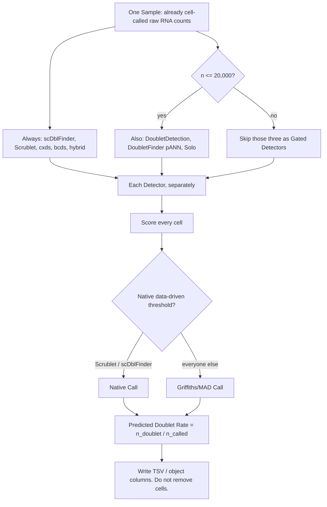

# Doublet

单细胞 RNA 测序多胞（[Doublet](CONTEXT.md#doublet)）检测知识库与分析工具集。

对 **一个** [Sample](CONTEXT.md#sample) 的每个细胞打 [Doublet Score](CONTEXT.md#doublet-score)，用数据驱动规则做出 [Call](CONTEXT.md#doublet-call)，并报告 [Predicted Doublet Rate](CONTEXT.md#predicted-doublet-rate)（`n_doublet / n_called`）。**不**做细胞 [Removal](CONTEXT.md#removal)，**不**把多个 [Detector](CONTEXT.md#detector) 融合成共识。

可安装包：R **doubletRate**（Seurat 优先）、Python **rna-doublet-rate**（`import doublet_rate`）。CLI 旗标与完整 Detector 表以 [SKILL.md](SKILL.md) 为准。

## 功能

并行跑 RNA-only roster（并排报告，不是 ensemble）：

- scDblFinder（默认 [Primary Detector](CONTEXT.md#primary-detector)）
- Scrublet
- cxds / bcds / hybrid（scds）
- DoubletFinder（只用 pANN）
- DoubletDetection
- Solo（仅 CUDA / Apple MPS）

不做：细胞过滤、QC、聚类、整合、哈希/基因型 demux、[OmniDoublet](#benchmark) 式多模态融合。DoubletDecon 无连续 Score，不在 roster。



## 快速开始

```bash
git clone https://github.com/bio-apple/doublet.git
cd doublet
python3 -m pip install -e ".[full]"
Rscript scripts/install_r_packages.R
R CMD INSTALL .
python3 -m doublet_rate --list-detectors
python3 -m doublet_rate test --output-dir test_out --write-h5ad
```

[`test/`](test/) 是 10x pbmc3k filtered MTX（2,700 细胞）。会写出 `test_out/test.doublet_sample.tsv`。这条命令跑 **完整 roster**，含 Solo（慢）。`--list-detectors` 只打印 `always` / `gated`。

Seurat：

```r
library(doubletRate)
seu <- annotate_doublets(seu)
```

Scanpy：

```python
from doublet_rate import detect_doublets

adata = detect_doublets(adata)
```

`doublet_score` / `predicted_doublet` 复制一个 [Primary Detector](CONTEXT.md#primary-detector)（默认 scDblFinder），不是共识。[Gated Detector](CONTEXT.md#gated-detector) 在 n>20,000 时 skip；Solo 无 GPU 时是 `skipped:no_gpu`。参数说明见 [SKILL.md](SKILL.md)。

## 支持输入

一个已经 cell-called 的 RNA [Sample](CONTEXT.md#sample)：

| 项 | 要求 |
|---|---|
| 格式 | 10x MTX 目录、10x `.h5`、单样本 `.h5ad`；或内存中的 Seurat / SingleCellExperiment / AnnData |
| 数值 | **Raw counts**（UMI/read 整数）。h5ad 若 `.X` 已归一化，用 `layers['counts']` |
| 条码 | 唯一细胞 barcode |
| 单位 | **一次 capture**。多样本 `obs` 列（`sample` / `batch` / `orig.ident` …）拒绝 |
| 细胞鉴定 | **上游已完成**。传 filtered barcodes，不要 empty droplets |

不要传入 log-normalized、scaled、integrated 矩阵或 `obsm` embedding。本工具不做 QC / 聚类 / 整合。细节：[SKILL.md](SKILL.md#input)。

## 支持输出

| 去向 | 内容 |
|---|---|
| `{stem}.doublet_cells.tsv` | 每个 barcode、每个 Detector 的 Score 与 Call |
| `{stem}.doublet_sample.tsv` | 每个 Detector 的 `n_input` / `n_scored` / `n_called` / `n_doublet` / `predicted_doublet_rate` / `status` / `skipped_reason` / `call_rule` |
| `{stem}.doublet.h5ad` | CLI `--write-h5ad`；`obs` 上同样的列 |
| Seurat / SCE / AnnData | 对象上写入上述列；细胞不被删 |

便利列：`doublet_score`、`predicted_doublet`、`is_doublet`（后两者同值）。空 Call 在 `predicted_doublet` 里是 NA，不是 FALSE。完整列名与 `status` 取值：[SKILL.md](SKILL.md#output)。

## 结果解释

- **Score**：该 Detector 认为该细胞有多像 doublet；越高越像。不要把它当成校准概率。
- **Call**：doublet / singlet / 空。空不是 singlet，不算进 Predicted Rate 的分母（[ADR 0011](docs/adr/0011-rate-denominator-is-n-called.md)）。
- **Predicted Doublet Rate**：`n_doublet / n_called`，每个 Detector 各自一条，不融合。
- **不要用 Expected Doublet Rate**（`nExp`、`dbr`、10x 每 1000 细胞 0.8%）去切 Call（[ADR 0002](docs/adr/0002-no-expected-rate-for-calls.md)）。
- **status**：`ran` 跑完；`skipped` 为 Size gate 或缺包；`skipped:no_gpu` 为 Solo 没有 CUDA/MPS；`failed` 为崩溃。一个 Detector 失败不中止整次 Sample。
- **Primary 列**只是 scDblFinder（或你指定的 `--primary`）的拷贝。子集细胞请看清你用的是便利列还是某个 `{name}_call`。
- OSCA 提醒：高分细胞里常有轨迹中间态；报告 rate，不要自动删细胞（[ADR 0001](docs/adr/0001-score-call-rate-not-removal.md)）。

词表：[CONTEXT.md](CONTEXT.md)。失败模式与 skip 字符串：[reference.md](reference.md#failure-modes)。

## 方法选择指南

本工具的默认是 **八个方法并排**，不是替你选一个赢家（[ADR 0004](docs/adr/0004-parallel-methods-no-fusion.md)）。若只看一列：用 Primary（默认 scDblFinder）。

| 情况 | 建议 |
|---|---|
| 常规 10x RNA，n ≤ 20,000 | 跑完整 roster；看 sample 表里各 Detector 的 rate，不要平均 |
| n > 20,000 | scDblFinder、Scrublet、cxds、bcds、hybrid 仍跑；DoubletDetection / DoubletFinder / Solo 为 [Gated Detector](CONTEXT.md#gated-detector)（`size_gate:>20000`） |
| 只要 Scanpy 便利列 | `detect_doublets(adata)`；`predicted_doublet` = Primary |
| 只要 Seurat `meta.data` | `annotate_doublets(seu)`；R 仍调用 `python -m doublet_rate` |
| 没有 GPU | Solo 为 `skipped:no_gpu`，其余方法照跑 |
| 想用 OmniDoublet / 哈希 / 基因型 | 超出范围；见下方 Benchmark |

Call 规则：Scrublet、scDblFinder 用各自不依赖 Expected Rate 的 native 阈值；其余用 Griffiths/MAD。表与 `--list-detectors`：[SKILL.md](SKILL.md#detectors)。

## Benchmark

本仓库 **不发布自有精度榜**。Size gate 与是否纳入 roster 依据公开评测与运行时，而不是把 expected rate 写成 Call：

| 来源 | 本工具怎么用 |
|---|---|
| Xi and Li, *Cell Systems* 2021 | 方法名单与 DoubletDetection 在大样本上的扩展性 → 20,000 Size gate；DoubletDecon 无连续 Score → 不跑 |
| Xi and Li, *STAR Protocols* 2021 | 八方法操作基线；本工具改掉了 expected-rate Call |
| Neavin et al., Demuxafy, *Genome Biology* 2024 | Solo 在 ~20k 上中位约 13 h → Solo 为 Gated Detector，且无 GPU 不跑 CPU |
| Zhang et al., *Cell Genomics* 2024 | `nExp` 改 DoubletFinder 的 class、不改 pANN → 丢 class，MAD 打在 pANN 上 |
| Liu et al., OmniDoublet, 2025 | 多模态融合。本工具只读其 RNA 子集讨论，**不实现、不融合** |

本地 [`test/`](test/) pbmc3k 用来验收安装，不是精度 gold standard。

## References

- OSCA.advanced 3.23 ch. 8, [Doublet detection](https://bioconductor.org/books/3.23/OSCA.advanced/doublet-detection.html)
- Xi and Li, *Cell Systems* 2021. Benchmark of computational doublet-detection methods
- Xi and Li, *STAR Protocols* 2021. Protocol for eight methods
- Germain et al., *F1000Research* 2021. scDblFinder
- Bais and Kostka, *Bioinformatics* 2020. scds (cxds / bcds / hybrid)
- Wolock et al., *Cell Systems* 2019. Scrublet
- McGinnis et al., *Cell Systems* 2019. DoubletFinder
- Gayoso et al. DoubletDetection
- Bernstein et al., *Cell Systems* 2020. Solo
- Neavin et al., *Genome Biology* 2024. Demuxafy
- Zhang et al., *Cell Genomics* 2024. Expected rate vs DoubletFinder scores
- She et al., *CSBJ* 2025. Expected rate as a removal-count knob — not used here
- Liu et al., *Briefings in Bioinformatics* 2025. OmniDoublet（多模态；不在本 roster）

完整参数、skip 原因与引用笔记：[reference.md](reference.md)。决策记录：[docs/adr/](docs/adr/)。运行契约：[SKILL.md](SKILL.md)。
